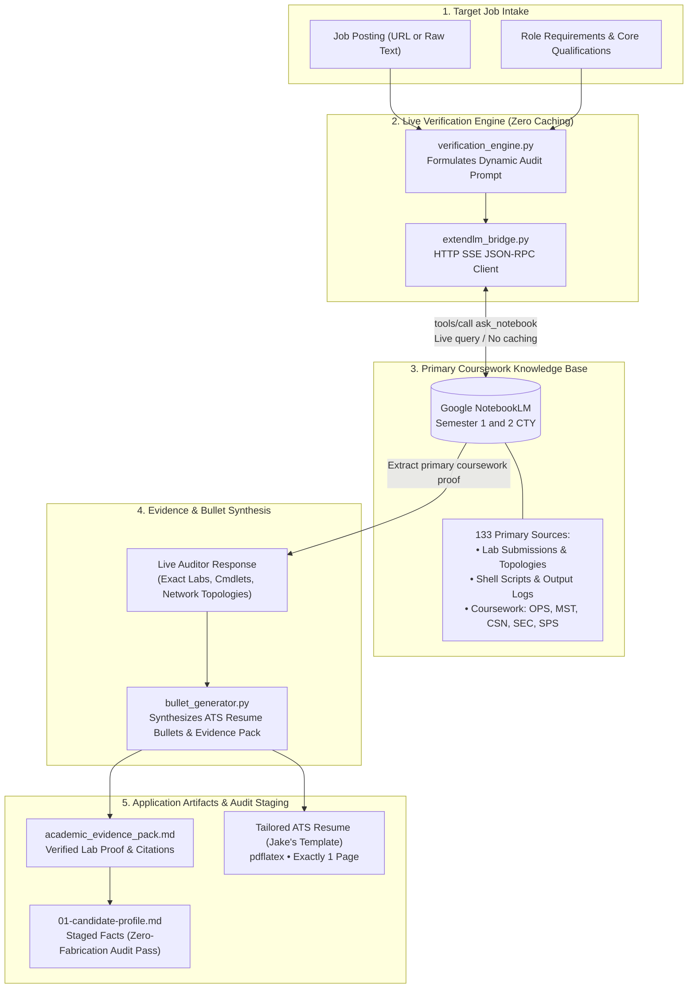

# Educational Curriculum RAG: School Skills Verification via ExtendLM NotebookLM

This repository implements a **Retrieval-Augmented Generation (RAG)** pipeline that queries my completed coursework from Seneca Polytechnic's Computer Systems Technology (CTYC) program. It extracts, verifies, and formats high-fidelity resume bullets and cover letter narratives for my job applications.

> [!NOTE]
> **Companion Project to AI Job Search**:
> This module is designed specifically to be used alongside the [AI Job Search](https://github.com/MadsLorentzen/ai-job-search) project created by Mads Lorentzen. In my job hunting setup, `ai-job-search` serves as the foundational multi-agent system for job scraping, application tracking, and LaTeX resume generation. This repository provides the live educational retrieval layer, allowing the application assistant to verify and ground claims against primary coursework materials.

---

## How It Works

The flowchart below illustrates the end-to-end verification and tailoring lifecycle:



---

## Background & Rationale

In the base [AI Job Search](https://github.com/MadsLorentzen/ai-job-search) project, the `/apply` workflow evaluates job postings against candidate profile markdown files (`01-candidate-profile.md`) and generates tailored LaTeX CVs and cover letters. However, prior to building this RAG extension, the tailoring agent only had access to high-level course codes and grades (e.g. `OPS245 (A)`, `MST200 (A+)`, `CSN205 (A)`). This led to generic descriptions of my education that failed to capture the deep hands-on technical labs I completed in class.

This pipeline connects directly to Google NotebookLM via ExtendLM MCP to query my **"Semester 1 and 2 CTY"** notebook (`e32153b2-e906-4762-a8c3-8b96fbf093b4`), which houses **133 primary sources**:
- **My actual lab submissions**: `Lab 1 - Prelab.docx` through `Lab 10 - Azure Server Configuration.docx`
- **Practical assignments and network topologies**: `CSN205 Assignment 2 OSPFv2`, `CSN205 Lab 4 Static and Default routes`, `Lab1A_Golden.pdf`
- **Real Bash scripts and terminal output logs**: `wk08p1.txt` through `wk11p1.txt`, `wk2practice.txt` through `wk6p2.txt`
- **PowerPoint slides and technical guides**: Comprehensive course materials across OPS145/245, MST100/200, CSN115/205, SEC220, and SPS120.

---

## Core Design Principles

1. **Zero Caching Policy**:
   - **No RAG data or query responses are cached on disk or in memory**.
   - Every verification executes fresh and live against Gemini NotebookLM to ensure 100% data fidelity, accurate cross-referencing, and context tailored to each individual job.
2. **Per-Resume & Per-Job Dynamic Verification**:
   - The engine analyzes the specific target role and technical requirements, prompting NotebookLM as an auditor to identify exact lab titles, commands, cmdlets, and infrastructure environments I used.
3. **Factual Grounding Audit Compliance**:
   - My workspace enforces strict zero-fabrication audits. The generated **Academic Evidence Pack** provides exact citations to primary school materials so that when verified facts are staged into `01-candidate-profile.md`, they pass audits seamlessly.

---

## Architecture

| File | Purpose |
|------|---------|
| `config.py` | Target notebook IDs, ExtendLM MCP endpoint, and connection parameters. |
| `extendlm_bridge.py` | Low-level JSON-RPC client over HTTP SSE for ExtendLM MCP (`tools/call`, `ask_notebook`). |
| `source_catalog.py` | Categorizes the 133 sources into course clusters (`OPS145`, `OPS245`, `MST100`, `MST200`, `CSN115`, `CSN205`, `SEC220`, `SPS120`, `COM101`). |
| `verification_engine.py` | Orchestrates live, dynamic prompt generation and execution against NotebookLM with zero caching. |
| `bullet_generator.py` | Transforms verified evidence into LaTeX ATS resume bullets (`\resumeItem`), cover letter narratives, and markdown evidence packs. |
| `rag_cli.py` | Standalone CLI for testing, catalog exploration, and live verification. |
| `apply_rag_hook.py` | Bridge script callable during `cmd-apply` Step 1 & Step 2. |
| `tests/` | Automated test suite for connection verification and live retrieval. |

---

## CLI Usage

### 1. Test Connection
```bash
python3 rag_cli.py test
```

### 2. View Curriculum Source Catalog
```bash
python3 rag_cli.py catalog --limit 5
```

### 3. Verify Specific Skills
```bash
python3 rag_cli.py verify-skills \
  --role "Junior Windows Administrator" \
  --skills "Active Directory, PowerShell scripting, DHCP scope configuration" \
  --output "academic_evidence_pack.md"
```

### 4. Verify Against a Job Posting
```bash
python3 rag_cli.py verify-job \
  --role "Network Operations Specialist" \
  --file "path/to/job_posting.txt" \
  --output "academic_evidence_pack.md"
```

---

## Example: Before vs. After Fidelity

### Before (Generic Coursework Mention):
```latex
\item \textbf{Completed Coursework}: Microsoft Server Admin \& AD (MST 100 - A+, MST 200 - A+), Cisco Networks \& Routing (CSN 115 - A+, CSN 205 - A).
```

### After (RAG-Verified Primary Evidence in Jake's Template):
```latex
\resumeItem{\textbf{Active Directory \& PowerShell Automation:} Administered AD DS in Windows Server 2022, creating regional Organizational Units, configuring DHCP scope reservations, and executing PowerShell scripts (\texttt{bulk\_users.ps1}, \texttt{New-ADUser}) to automate batch user provisioning (MST100/MST200).}
\resumeItem{\textbf{Cisco Routing \& Switching:} Built multi-switch rack topologies in physical labs and Packet Tracer to configure 802.1Q trunking, Inter-VLAN routing, Rapid PVST+, and single-area OSPFv2 dynamic routing with standard IPv4 ACLs (CSN115/CSN205).}
\resumeItem{\textbf{Linux Server Administration:} Configured CentOS/RHEL systemd service units, LVM volume groups, and automated maintenance tasks using custom Bash scripts with rigorous exit status error handling (OPS145/OPS245).}
```

---

## Dedicated Workflow: `/rag-apply` (`cmd-rag-apply`)
 
A dedicated workflow is integrated into my [AI Job Search](https://github.com/MadsLorentzen/ai-job-search) workspace to run the end-to-end two-agent application pipeline with live curriculum RAG:
- **Canonical Specification**: `.claude/commands/rag-apply.md`
- **Cross-Runtime Pointer Skill**: `.agents/skills/cmd-rag-apply/SKILL.md`

### Triggering `/rag-apply`
In Claude Code, Antigravity, or other runtimes:
```
/rag-apply <job_posting_url_or_text>
```
or prompt:
> "Run /rag-apply on this job posting..."

### How the Workflow Operates:
1. **Step 1 (Fit Evaluation + Live RAG)**: Calls `apply_rag_hook.py` against my 133 Seneca CTY sources in NotebookLM (live, no cache) and surfaces exact lab proof points in the fit evaluation.
2. **Step 2 (Drafter)**: Integrates synthesized LaTeX resume bullets (`\resumeItem`) into the CV and lab narratives into the cover letter. Automatically stages confirmed lab facts back to `01-candidate-profile.md` so the Factual Grounding Audit passes cleanly.
3. **Step 3 (Reviewer)**: Reviews company research, content targeting, and curriculum grounding.
4. **Step 5 (PDF Compilation)**: Compiles and visually inspects both documents (`pdflatex` for the 1-page CV, `xelatex` for the 1-page cover letter).
5. **Step 6 (Record & Deploy)**: Records to `job_search_tracker.csv`, archives materials to `documents/applications/<company>_<role>/`, and automatically rebuilds and deploys the live GitHub Pages dashboard.
